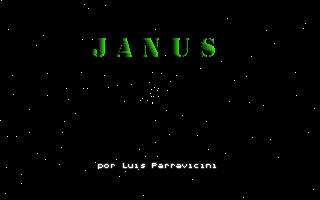
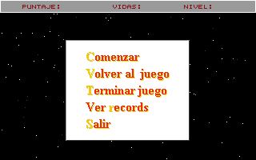
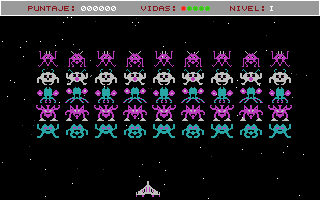
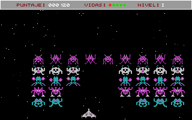
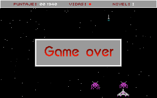

Janus
=====

First game I've made, in the good ol' days of 1995.
Coded in Pascal and Assembler and using the beautiful [mode 13h](http://en.wikipedia.org/wiki/Mode_13h) (320x200, 256 colors).

The game and the source code comments are in Spanish. The sprites are ripped from [Space Commanders](http://en.wikipedia.org/wiki/Space_Commanders).

Gameplay: https://www.youtube.com/watch?v=dKUngHAKZ_I

Some screenshots:

The game ends on level 21 and shows the following message:

    Fin de la versión demo
    Por falta de tiempo no se pudo
    hacer la final del juego.

which translates as:

    End of demo version
    There was no time to make
    the end of the game.

La misma información de este documento en Español se encuentra en http://ktulu.com.ar/blog/2012/10/10/janus/
